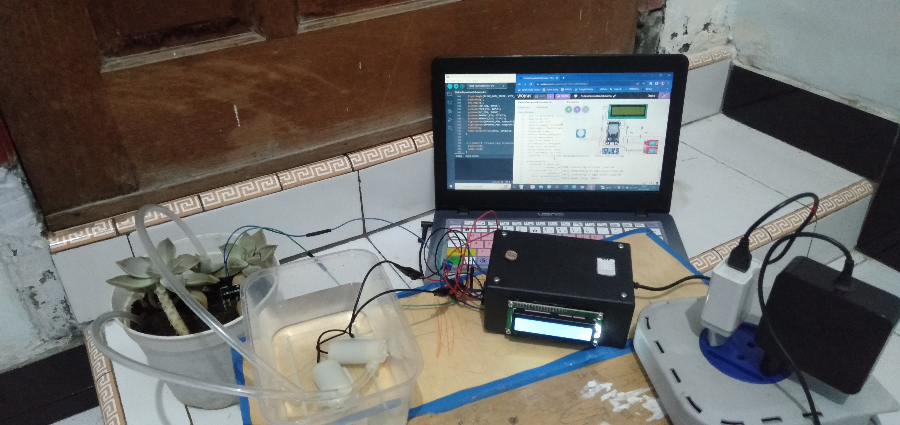
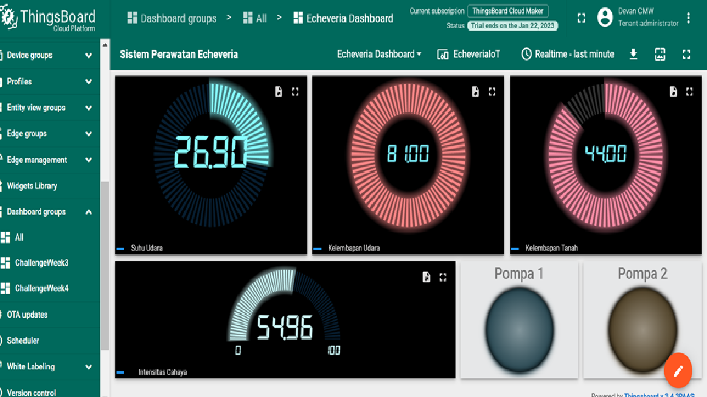

[](https://github.com/ellerbrock/open-source-badges/)
[](https://opensource.org/licenses/MIT)


# Smart Plant Care System (Echeveria Peacockii)
<strong>IoT Master Class Indobot 2022 Final Project</strong><br><br>
Echeveria Peacockii is a type of plant that is related to cactus, but there are no thorns on the body of this plant, making it very attractive to ornamental plant lovers. The care of Echeveria Peacockii until now is still done conventionally, making it wasteful of time and energy. Therefore, this project was created to obtain a system that is able to perform watering as well as being able to monitor changes in conditions that exist in the environment around the plant. This project has been implemented and took approximately 1 month. The system interface uses Telegram Bot. The results showed that the system created can function properly.

<br><br>

## Project Requirements
| Part | Description |
| --- | --- |
| Development Board | DOIT ESP32 DEVKIT V1 |
| Code Editor | Arduino IDE 1.8.19 (Stable Legacy Version) |
| Application Support | Telegram Bot |
| Driver | CP210X USB Driver |
| IoT Platform | • Blynk<br>• ThingsBoard |
| Communications Protocol | • Inter Integrated Circuit (I2C)<br>• Message Queuing Telemetry Transport (MQTT)<br>• Transmission Control Protocol/Internet Protocol (TCP/IP)<br>• MTProto |
| IoT Architecture | 4 Layer |
| Programming Language | C/C++ |
| Arduino Library | • WiFi (default)<br>• BlynkSimpleEsp32 by Volodymyr Shymanskyy (Version: 1.1.0)<br>• ThingsBoard by ThingsBoard Team (Version: 0.9.0)<br>• PubSubClient by Nick O'Leary (Version: 2.8)<br>• CTBot by Stefano Ledda (Version: 2.1.11)<br>• ArduinoJson by Benoit Blanchon (Version: 6.19.4)<br>• LiquidCrystal_I2C by Frank de Brabander (Version: 1.1.2)<br>• DHT_sensor_library by Adafruit (Version: 1.4.6)<br>• ESP_FC28 by cakraawijaya (Version: 1.0.0) |
| Actuators | • Submersible pump (x2)<br>• Electromechanical relay 2-channel (x1) |
| Sensor | • FC-28: Resistive Soil Moisture (x1)<br>• LDR: Light Dependent Resistor 12mm (x1)<br>• DHT22: Air Temperature & Humidity (x1) |
| Display | LCD I2C (x1) |
| Other Components | • Micro USB cable - USB type A (x1)<br>• Jumper cable (1 set)<br>• ESP32 expansion board (x1)<br>• Breadboard (x1)<br>• Adaptor DC 5V (x1)<br>• Resistor (x2)<br>• Casing box (x1)<br>• Bolts plus (1 set)<br>• Nuts (1 set) |

<br><br>

## Download & Install
1. Arduino IDE

   <table><tr><td width="810">

   ```
   https://bit.ly/ArduinoIDE_Installer
   ```

   </td></tr></table><br>

2. CP210X USB Driver

   <table><tr><td width="810">

   ```
   https://bit.ly/CP210X_USBdriver
   ```

   </td></tr></table>
   
<br><br>

## Project Designs
<table>
<tr>
<th width="840">Infrastructure</th>
</tr>
<tr>
<td></td>
</tr>
</table>
<table>
<tr>
<th width="840">Pictorial Diagram</th>
</tr>
<tr>
<td></td>
</tr>
</table>
<table>
<tr>
<th colspan="2">Software Design</th>
</tr>
<tr>
<td width="420"></td>
<td width="420"></td>
</tr>
</table>
<table>
<tr>
<th width="840">Wiring</th>
</tr>
<tr>
<td></td>
</tr>
</table>

<br><br>

## Scanning the I2C Address on the LCD
<table><tr><td width="840">

```ino
/*
  =====================================================
  I2C Scanner for Arduino / ESP32 / ESP8266
  by: Devan Cakra Mudra Wijaya, S.Kom.
  =====================================================

  Functions:
  - Detects all connected I2C devices
  - Displays device addresses in HEX format
  - Displays the total number of detected devices


  =====================================================
  SDA and SCL Pins for Arduino / ESP32 / ESP8266
  =====================================================
  Arduino I2C Connection (default):
  - Arduino Uno / Nano (ATmega328P)
    SDA -> A4
    SCL -> A5

  - Arduino Mega 2560
    SDA -> D20
    SCL -> D21

  - Other Arduino boards
    SDA -> SDA pin
    SCL -> SCL pin
    (Refer to the datasheet or board pinout)

  ESP32 I2C Connection (default):
  SDA -> GPIO 21
  SCL -> GPIO 22

  ESP8266 I2C Connection (default):
  SDA -> GPIO 4 (D2)
  SCL -> GPIO 5 (D1)
*/

// Include the Wire library for I2C communication
#include <Wire.h>

// Constant that defines the delay between scans (5000 ms = 5 seconds)
const uint32_t SCAN_INTERVAL = 5000;


// Function to initialize I2C communication
// SDA and SCL pin configuration will be adjusted automatically based on the board being used
void initI2C() {

  // If the board being used is ESP32:
  #if defined(ESP32)

    // Enable I2C communication
    // SDA = GPIO21
    // SCL = GPIO22
    Wire.begin(21, 22);

  // If the board being used is ESP8266:
  #elif defined(ESP8266)

    // Enable I2C communication
    // SDA = D2 (GPIO4)
    // SCL = D1 (GPIO5)
    Wire.begin(D2, D1);

  // If the board is neither ESP32 nor ESP8266
  // Examples: Arduino Uno, Nano, Mega, Leonardo, etc.
  #else

    // Enable I2C communication using the board's built-in hardware pins
    Wire.begin();

  #endif

}


// The setup() function runs once when the board is powered on or reset
// It is used to initialize hardware, serial communication, sensors, modules, and the program's initial configuration
void setup() {

  // Start Serial communication at 115200 baud rate
  Serial.begin(115200);

  // Check whether the board uses native USB
  // Examples: Arduino Leonardo, Arduino Micro, some ESP32-S2/S3 boards
  #if defined(USBCON) || defined(ARDUINO_USB_CDC_ON_BOOT)

    // If yes:
    // The program will wait until the Serial Monitor is connected before continuing execution
    while (!Serial);

  #endif

  // Wait for 2 seconds before starting the program
  delay(2000);

  // Display program header
  Serial.println("====================================");
  Serial.println("         I2C DEVICE SCANNER         ");
  Serial.println("by: Devan Cakra Mudra Wijaya, S.Kom.");
  Serial.println("====================================");

  // Print an empty line
  Serial.println();

  // Initialize I2C communication
  initI2C();
}


// The loop() function runs continuously after setup() has finished
// The main program logic is typically placed inside this function
void loop() {

  // Variable to store the error code returned from I2C communication
  uint8_t error;

  // Variable to store the I2C address currently being checked
  uint8_t address;

  // Counter variable for the number of detected devices
  uint8_t deviceCount = 0;

  // Display information indicating that the scan process has started
  Serial.println("------------------------------------");
  Serial.println("Scanning I2C bus...");
  Serial.println("------------------------------------");

  // Loop through addresses from 1 to 126
  // Valid I2C addresses range from 0x01 to 0x7E
  for (address = 1; address < 127; address++) {

    // Start communication with the address currently being tested
    Wire.beginTransmission(address);

    // End the transmission and store the result
    // 0 = success
    // 1 = data too long
    // 2 = NACK received when address was sent
    // 3 = NACK received when data was sent
    // 4 = other error
    error = Wire.endTransmission();

    // If no error occurs:
    if (error == 0) {

      // Display information that a device was found
      Serial.print("[FOUND] Device at address 0x");

      // If the address is less than 16:
      // Add a leading zero to keep HEX formatting aligned
      if (address < 16) {
        Serial.print("0");
      }

      // Display the address in HEX format
      Serial.println(address, HEX);

      // Increment the detected device count
      deviceCount++;
    }

    // If an unknown error occurs:
    else if (error == 4) {

      // Display an error message
      Serial.print("[ERROR] Unknown error at address 0x");

      // If the address is less than 16:
      // Add a leading zero to keep HEX formatting aligned
      if (address < 16) {
        Serial.print("0");
      }

      // Display the problematic address in HEX format
      Serial.println(address, HEX);
    }

    // If the error is neither 0 nor 4:
    // Ignore it, as this usually means no device exists at that address
  }

  // Print an empty line
  Serial.println();

  // If no devices were found:
  if (deviceCount == 0) {

    // Display a message indicating that no devices were found
    Serial.println("No I2C devices found.");
  }
  else { // If at least one device was found:

    // Display the total number of detected devices
    Serial.print("Total devices found: ");

    // Display the value of deviceCount
    Serial.println(deviceCount);
  }

  // Display information about the next scan
  Serial.print("Next scan in ");

  // Convert milliseconds to seconds
  Serial.print(SCAN_INTERVAL / 1000);

  // Display the unit in seconds
  Serial.println(" seconds.");

  // Empty line
  Serial.println("\n");

  // Wait 5 seconds before performing the next scan
  delay(SCAN_INTERVAL);
}
```

</td></tr></table><br><br>

## Arduino IDE Setup
1. Open the ``` Arduino IDE ``` first, then open the project by clicking ``` File ``` -> ``` Open ``` :

   <table><tr><td width="810">
      
      ``` SistemPerawatanEcheveriaBlynkIoT.ino ``` or ``` SistemPerawatanEcheveriaThingsboardIoT.ino ```

   </td></tr></table><br>
   
2. Fill in the ``` Additional Board Manager URLs ``` in Arduino IDE

   <table><tr><td width="810">
         
      Click ``` File ``` -> ``` Preferences ``` -> enter the ``` Boards Manager Url ``` by copying the following link :
      
      ```
      https://dl.espressif.com/dl/package_esp32_index.json
      ```

   </td></tr></table><br>
   
3. ``` Board Setup ``` in Arduino IDE

   <table>
      <tr><th width="810">

      How to setup the ``` DOIT ESP32 DEVKIT V1 ``` board
            
      </th></tr>
      <tr><td width="810">
         
      • Click ``` Tools ``` -> ``` Board ``` -> ``` Boards Manager ``` -> Install ``` esp32 ```.
   
      • Then selecting a board by clicking: ``` Tools ``` -> ``` Board ``` -> ``` ESP32 Arduino ``` -> ``` DOIT ESP32 DEVKIT V1 ```.

      </td></tr>
   </table><br>
   
4. ``` Change the Board Speed ``` in Arduino IDE

   <table><tr><td width="810">
         
      Click ``` Tools ``` -> ``` Upload Speed ``` -> ``` 115200 ```

   </td></tr></table><br>
   
5. ``` Install Library ``` in Arduino IDE

   <table><tr><td width="810">
         
      Download all the library zip files. Then paste it in the: ``` C:\Users\Computer_Username\Documents\Arduino\libraries ```

   </td></tr></table><br>

6. ``` Port Setup ``` in Arduino IDE

   <table><tr><td width="810">
         
      Click ``` Port ``` -> Choose according to your device port ``` (you can see in device manager) ```

   </td></tr></table><br>

7. Change the ``` WiFi Name ```, ``` WiFi Password ```, and so on according to what you are currently using.<br><br>

8. Before uploading the program, please click: ``` Verify ```.<br><br>

9. If there is no error in the program code, then please click: ``` Upload ```.<br><br>
    
10. Some things you need to do when using the ``` ESP32 board ``` :

    <table><tr><td width="810">
       
       • If ``` ESP32 board ``` cannot process ``` Source Code ``` totally -> Press ``` EN (RST) ``` button -> ``` Restart ```.

       • If ```ESP32 board ``` cannot process ``` Source Code ``` automatically then :<br>

      - When information: ``` Uploading... ``` has appeared -> immediately press and hold the ``` BOOT ``` button.<br>

      - When information: ``` Writing at .... (%) ``` has appeared -> release the ``` BOOT ``` button.

      • If message: ``` Done Uploading ``` has appeared -> ``` The previously entered program can already be operated ```.

      • Do not press the ``` BOOT ``` and ``` EN ``` buttons at the same time as this may switch to ``` Upload Firmware ``` mode.

    </td></tr></table><br>

11. If there is still a problem when uploading the program, then try checking the ``` driver ``` / ``` port ``` / ``` others ``` section.

<br><br>

## Blynk Setup
1. Getting started with blynk :

   <table><tr><td width="810">
      
      • Go to the official Blynk website: <a href="https://blynk.io">blynk.io</a>.
      
      • Click ``` Start Free ``` untuk mendaftar.
      
      • Enter an email.
      
      • Open email for confirmation.
      
      • Log in using the account that has been created.

   </td></tr></table><br>
   
2. Create a new template :

   <table><tr><td width="810">
      
      • Click ``` Developer Zone ``` -> then select ``` My Templates ``` option.
      
      • Then click ``` + New Templates ``` to create a New Template.
      
      • The ``` NAME ``` section is filled with ``` Smart Farming ```, ``` HARDWARE ``` select ``` ESP32 ```, ``` CONNECTION TYPE ``` select ``` WiFi ```, ``` TEMPLATE DESCRIPTION ``` is optional.
      
      • Click ``` Done ```.

   </td></tr></table><br>
   
3. Create datastreams :

   <table><tr><td width="810">
      
      • Enter ``` Datastreams ``` menu -> click ``` + New Datastreams ``` -> select ``` Virtual Pin ```.
      
      • Input the first data :
      
      - ``` NAME ``` -> ``` suhu_udara ```
      - ``` PIN ``` -> ``` V0 ```
      - ``` DATA TYPE ``` -> ``` Double ```
      - ``` UNITS ``` -> ``` Celcius, °C ```
      - ``` MIN ``` -> ``` 0 ```
      - ``` MAX ``` -> ``` 100 ```
      - ``` DECIMALS ``` -> ``` #.# ```
      - ``` DEFAULT VALUE ``` -> ``` 0 ```<br><br>
            
      • Input the second data :
   
      - ``` NAME ``` -> ``` kelembaban_udara ```
      - ``` PIN ``` -> ``` V1 ```
      - ``` DATA TYPE ``` -> ``` Integer ```
      - ``` UNITS ``` -> ``` Percentage, % ```
      - ``` MIN ``` -> ``` 0 ```
      - ``` MAX ``` -> ``` 100 ```
      - ``` DEFAULT VALUE ``` -> ``` 0 ```<br><br>
           
      • Input the third data :
   
      - ``` NAME ``` -> ``` kelembaban_tanah ```
      - ``` PIN ``` -> ``` V2 ```
      - ``` DATA TYPE ``` -> ``` Integer ```
      - ``` UNITS ``` -> ``` Percentage, % ```
      - ``` MIN ``` -> ``` 0 ```
      - ``` MAX ``` -> ``` 100 ```
      - ``` DEFAULT VALUE ``` -> ``` 0 ```<br><br>
      
      • Input the fourth data :
   
      - ``` NAME ``` -> ``` cahaya ```
      - ``` PIN ``` -> ``` V3 ```
      - ``` DATA TYPE ``` -> ``` Integer ```
      - ``` UNITS ``` -> ``` Lux, lx ```
      - ``` MIN ``` -> ``` 0 ```
      - ``` MAX ``` -> ``` 100000 ```
      - ``` DEFAULT VALUE ``` -> ``` 0 ```<br><br>
      
      • Input the fifth data :
   
      - ``` NAME ``` -> ``` indikator_pompa1 ```
      - ``` PIN ``` -> ``` V4 ```
      - ``` DATA TYPE ``` -> ``` Integer ```
      - ``` UNITS ``` -> ``` None ```
      - ``` MIN ``` -> ``` 0 ```
      - ``` MAX ``` -> ``` 1 ```
      - ``` DEFAULT VALUE ``` -> ``` 0 ```<br><br>
           
      • Input the sixth data :
   
      - ``` NAME ``` -> ``` indikator_pompa2 ```
      - ``` PIN ``` -> ``` V5 ```
      - ``` DATA TYPE ``` -> ``` Integer ```
      - ``` UNITS ``` -> ``` None ```
      - ``` MIN ``` -> ``` 0 ```
      - ``` MAX ``` -> ``` 1 ```
      - ``` DEFAULT VALUE ``` -> ``` 0 ```<br><br>
      
      • Input the seventh data :
   
      - ``` NAME ``` -> ``` tombol_siram ```
      - ``` PIN ``` -> ``` V6 ```
      - ``` DATA TYPE ``` -> ``` Integer ```
      - ``` UNITS ``` -> ``` None ```
      - ``` MIN ``` -> ``` 0 ```
      - ``` MAX ``` -> ``` 1 ```
      - ``` DEFAULT VALUE ``` -> ``` 0 ```<br><br>
         
      • Click ``` Create ```.
      
      • Click ``` Save ```.

   </td></tr></table><br>
   
4. Create a new device :

   <table><tr><td width="810">
      
      • Enter ``` Devices ``` menu.
      
      • Click ``` + New Devices ``` to add new devices.
      
      • Select ``` From Templates ``` :
      
      - ``` TEMPLATE ``` -> ``` Smart Farming ```
      - ``` DEVICE NAME ``` -> ``` Smart Farming ```<br><br>
           
      • Click ``` Create ```.

   </td></tr></table><br>
   
5. Manage dashboard on the Blynk site :

   <table><tr><td width="810">
      
      • Click ``` 3 dot symbol ``` -> then select ``` Edit Dashboard ```.
   
      • Select ``` the desired widget ``` then ``` drag ``` into the dashboard area.
   
      • Click ``` setting ``` on the added widget.
   
      • Select a datastream that is already available, among others: ``` suhu_udara ``` / ``` kelembaban_udara ``` / ``` kelembaban_tanah ``` / ``` cahaya ``` / ``` indikator_pompa1 ``` / ``` indikator_pompa2 ``` / ``` tombol_siram ```.
   
      • Click ``` Save And Apply ```.

   </td></tr></table><br>

6. Manage dashboards on the Blynk mobile app :

   <table><tr><td width="810">
      
      • Open your smart phone -> then in the ``` Google Play Store ```, find the application called ``` Blynk IoT ``` -> then ``` install ```.
   
      • Open the application -> then do the configuration as on the Blynk site earlier.
   
      • For the rest, you can search for tutorials on ``` Google ``` to enrich your knowledge.

   </td></tr></table><br>
   
7. Firmware configuration :

   <table><tr><td width="810">
      
      • Go to ``` Devices ``` menu -> select ``` Smart Farming ``` -> click ``` Device Info ```.
   
      • Copy ``` Template ID ```, ``` Template Name ```, and ``` AuthToken ```.
   
      • Then paste it at the very top of the firmware code, for example like this :
   
      ```ino
      #define BLYNK_TEMPLATE_ID "TMPL6ZSHxYC-z"
      #define BLYNK_TEMPLATE_NAME "Smart Farming"
      #define BLYNK_AUTH_TOKEN "fw1oXlpe-YfYh7JXQHu4QTS3EqlnM-iw"
      ```

   </td></tr></table>
   
<br><br>

## ThingsBoard Setup
1. Getting started with ThingsBoard :

   <table><tr><td width="810">
      
      • Go to the official ThingsBoard website: <a href="https://thingsboard.cloud/">thingsboard.cloud</a>.
      
      • Log in with google account.

   </td></tr></table><br>
   
2. Create a new device profile :

   <table><tr><td width="810">
      
      • Go to ``` Profiles ``` menu -> then select ``` Device profiles ```.
   
      •  Click ``` + (Add device profile) ```.
   
      •  Device profile details: ``` Name ``` -> ``` MQTT ```.
   
      •  Transport configuration: ``` Transport type ``` -> ``` MQTT ```. Then fill in the MQTT data as shown below :

      <table><tr><td width="810">

      - Telemetry topic filter: ``` v1/devices/me/telemetry/fpiotdevan ```. This should be the same as the one in the firmware code.
        
      - Attributes publish & subscribe topic filter: ``` v1/devices/me/attributes/fpiotdevan ```. This should be the same as the one in the firmware code.
        
      - MQTT device payload : ``` JSON ```.

      </td></tr></table>
   
      •  Click ``` Add ``` to add.

   </td></tr></table><br>
   
3. Create a new device :

   <table><tr><td width="810">
      
      • Go to ``` Entities ``` menu -> then select ``` Devices ``` -> ``` Groups ```.
   
      • Change the device access groups ``` All ``` to ``` Public ``` so that it can be used widely.
   
      • Open device groups ``` All ```.
   
      • Click ``` + (Add device) ```.
   
      • Make 1 device with the following conditions :

      <table><tr><td width="810">
      
      - ``` Name ``` -> ``` EcheveriaIoT ```
      - ``` Label ``` -> ``` EcheveriaIoT ```
      - ``` Device profile ``` -> ``` default ```

      </td></tr></table>
      
   </td></tr></table><br>
   
4. Create a dashboard :

   <table><tr><td width="810">
      
      • Go to ``` Dashboards ``` menu -> ``` Groups ``` -> ``` All ```.
   
      • Change the dashboard access groups ``` All ``` to ``` Public ``` so that it can be used widely.
   
      • Open dashboard groups ``` All ```.
   
      • Click ``` + (Add dashboard) ```.
   
      • Then name it ``` Echeveria Dashboard ``` -> click ``` Add ``` to add.
   
      • Change ``` title ``` to ``` Sistem Perawatan Echeveria ```.
   
      • Select ``` desired widget ``` -> settings on widgets.

   </td></tr></table><br>
   
5. Firmware configuration :

   <table><tr><td width="810">
      
      • Go to ``` Entities ``` menu -> then select ``` Devices ``` -> ``` Groups ```.
   
      • Click ``` EcheveriaIoT ``` -> copy the ``` Device ID ``` and ``` Token ``` mentioned.
   
      • Then paste in the firmware code, for example like this :
   
      ```ino
      #define DEVICE_ID_TB "26001630-a274-11ee-9db5-1fb69bbe078f"
      #define ACCESS_TOKEN_TB "tovosJJOLHzwc42DSfvM"
      ```

   </td></tr></table>

<br><br>

## Telegram Bot Setup
1. Open <a href="https://t.me/botfather">@BotFather</a>.<br><br>

2. Type ``` /newbot ```.<br><br>

3. Type the desired bot name, for example: ``` echeveria_bot ```.<br><br>

4. Type the desired bot username, for example: ``` echeveria_bot ```.<br><br>

5. Also do it for bot image settings, bot descriptions, and so on according to your needs.<br><br>

6. Copy ``` your telegram bot API token ``` -> then paste it into the ``` #define BOTtoken "YOUR_API_BOT_TOKEN" ``` section.

   <table><tr><td width="810">

   For example :
   
   ```ino
   #define BOTtoken "5911801402:AAFEEuBYHPmDxlYQxfPpTCZkRpn5d8hV_3E"
   ```

   </td></tr></table>

<br><br>

## Get Started
1. Download and extract this repository.<br><br>
    
2. Make sure you have the necessary electronic components.<br><br>
   
3. Make sure your components are designed according to the diagram.<br><br>
      
4. Configure your device according to the settings above.<br><br>
 
5. Please enjoy [Done].

<br><br>

## Highlights
<table>
<tr>
<th width="840">Device</th>
</tr>
<tr>
<td></td>
</tr>
</table>
<table>
<tr>
<th colspan="3">Telegram Bot Interface</th>
<th colspan="1">Monitoring via Blynk Mobile</th>
</tr>
<tr>
<td width="210"></td>
<td width="210"></td>
<td width="210"></td>
<td width="210"></td>
</tr>
</table>
<table>
<tr>
<th width="840">Monitoring via Thingsboard</th>
</tr>
<tr>
<td></td>
</tr>
</table>

<br><br>

## Demonstration of Application
Via Telegram: <a href="https://t.me/echeveria_bot">@echeveria_bot</a>

<br><br>

##  Notes
<blockquote>
   In this project, the millis() function has been implemented to minimize code blocking and improve efficiency. However, to get much more optimized results in the future, it is recommended to use RTOS (Real-Time Operating System) to manage task prioritization.
</blockquote>

<br><br>

## Appreciation
If this work is useful to you, then support this work as a form of appreciation to the author by clicking the ``` ⭐Star ``` button at the top of the repository.

<br><br>

## Disclaimer
This application is my own work and is not the result of plagiarism from other people's research or work, except those related to third party services which include: libraries, frameworks, and so on.

<br><br>

## LICENSE
MIT License - Copyright © 2023 - Devan C. M. Wijaya, S.Kom

Permission is hereby granted without charge to any person obtaining a copy of this software and the software-related documentation files to deal in them without restriction, including without limitation the right to use, copy, modify, merge, publish, distribute, sublicense, and/or sell copies of the Software, and to permit persons receiving the Software to be furnished therewith on the following terms:

The above copyright notice and this permission notice must accompany all copies or substantial portions of the Software.

IN ANY EVENT, THE AUTHOR OR COPYRIGHT HOLDER HEREIN RETAINS FULL OWNERSHIP RIGHTS. THE SOFTWARE IS PROVIDED AS IS, WITHOUT WARRANTY OF ANY KIND, EITHER EXPRESS OR IMPLIED, THEREFORE IF ANY DAMAGE, LOSS, OR OTHERWISE ARISES FROM THE USE OR OTHER DEALINGS IN THE SOFTWARE, THE AUTHOR OR COPYRIGHT HOLDER SHALL NOT BE LIABLE, AS THE USE OF THE SOFTWARE IS NOT COMPELLED AT ALL, SO THE RISK IS YOUR OWN.
